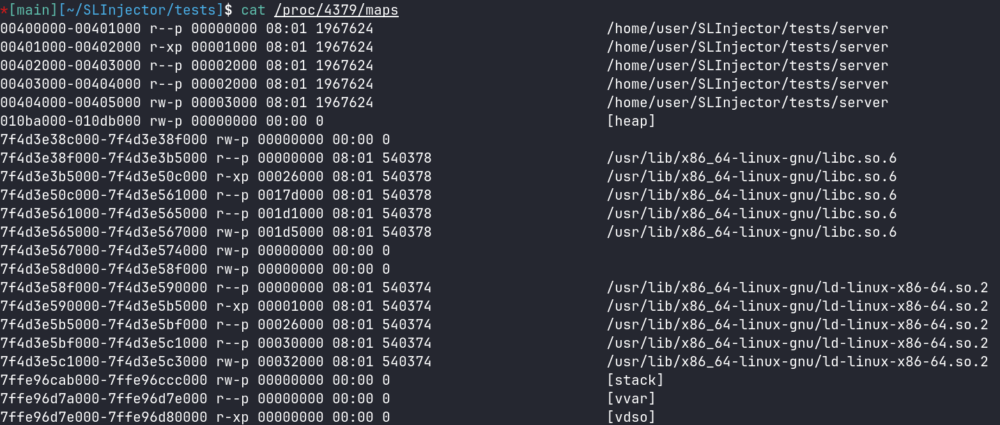
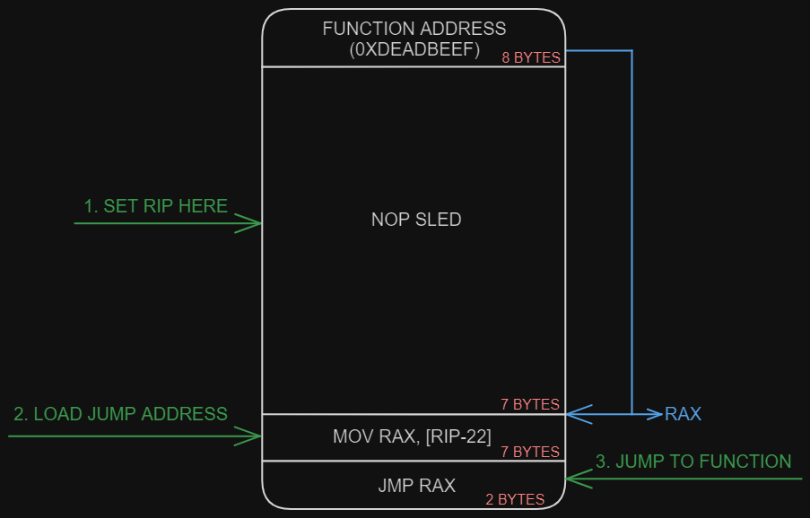

# Description

So, to perform Linux Process Injection, I will use the [ptrace](https://www.man7.org/linux/man-pages/man2/ptrace.2.html) system call. 
The first thing I tried to achieve was calling functions in a remote process using ptrace. For this, the following steps are needed:
 1. Attach to the process
 2. Find remote function address
 3. Call the function
    1. Write the arguments and return address
    2. Redirect program execution to the selected function
    3. Wait for the function to complete
    4. Restore target program execution

## 1. Attach to the process

To attach to a process using ptrace, you only need to call ptrace with the following parameters:
```C
ptrace(PTRACE_ATTACH, pid, NULL, NULL)
```
Next, you need to wait for the process to stop using the following code:
```C
waitpid(pid, NULL, 0)
```

Voila, now the process is stopped, and we can interact with it.

## 2. Find remote function address

To call a function, we obviously need to know its address. Since we only need to call functions from the standard library that both the target process and our process use, we can calculate the remote function's address using the following formula:
$$
RFA = LFA - LLBA + RLBA
$$
 - RFA -> __remote function address__
 - LFA -> __local function addresss__
 - LLBA -> __local libc base address__
 - RLBA -> __remote libc base address__

We already know that LFA is the function pointer in our process.

To find LLBA and RLBA we can read `/proc/<pid>/maps` and parse it. Example content of this file:


You can find parser code at `./src/slinjector.c:get_library_base_address`

# 3. Call the function

First of all, before calling a remote function, you need to save the current state of the program, specifically the values of all registers, using the following code:
```
struct user_regs_struct regs;
struct user_regs_struct saved_regs;
ptrace(PTRACE_GETREGS, pid, NULL, &regs);
memcpy(&saved_regs, &regs, sizeof(regs));
```
This is necessary to restore the program to its normal state after executing the desired function.

## 3.1 Write the arguments and return address

To use functions, you need to pass arguments to them. In the amd64 architecture calling convention, the first 6 arguments are passed in the registers `rdi`, `rsi`, `rdx`, `rcx`, `r8`, and `r9`. If there are more than 6 arguments, they are stored on the `stack`. Accordingly, for writing to registers, you can use the following call:
```C
ptrace(PTRACE_SETREGS, pid, NULL, &regs)
```

To write to the stack, you need to subtract the appropriate number of bytes from rsp:
```C
regs.rsp -= (argc - 6) * sizeof(long);
```

When calling a function, rsp should point to the return address. Therefore, to set it up, you need to subtract the size of a word from rsp, and then write the return address into the memory location pointed to by rsp:
```
regs.rsp -= sizeof(long);
remote_write_data(pid, (void *)regs.rsp, &return_address, sizeof(long));
```

To write something to memory, you need to use the following call:
```
ptrace(PTRACE_POKEDATA, pid, addr, data);
```

As the return address, you can simply use 0. This way, when the function finishes execution, it will attempt to continue execution at address 0, which will inevitably cause a segmentation fault. This is exactly what we need, as it allows us to precisely identify when the function has finished executing by waiting for the process to stop due to the error. Afterward, we can simply restore the saved registers, and the program will continue normal execution. This approach also allows us to handle any errors that occurred during the function call, and any crash will not affect the program’s functionality.
```
unsigned long return_address = 0;
```

## 3.2 Redirect program execution to the selected function

As is known, in the amd64 architecture, there is a register rip which points to the next instruction the processor should execute. Initially, I tried to set its value using PTRACE_SETREGS, but encountered an issue. When resuming the program’s execution, rip immediately decreases by 2 if it points to the start of a function. This puzzled me, but after some research, it became clear that this method wouldn’t work because the processor, after resuming execution following a stop, attempts to return to the syscall by subtracting the size of that instruction, which is 2. (Simply writing rip as the function address + 2 also doesn’t work, because in that case, the processor somehow doesn’t subtract 2)

So I came up with the idea of writing shellcode, which I will place in memory. This shellcode will include a NOP sled. By setting the rip register to the middle of this NOP sled, even if rip is adjusted by a few bytes, I will still remain within the NOP sled, continuing the execution of the program. At the end of the NOP sled, I place instructions that load the address from the start of the shellcode (which we need to write there) into the `rax` register, and then execute `jmp rax`, which transfers the execution flow to the address contained in the rax register.
```nasm
0xdeadbeef
nop
nop
nop
nop
nop
nop
nop
mov rax, [rip-22]
jmp rax
```

Visualization of how this shellcode works:


To write this shellcode, you need to allocate memory where it will be written. To do this, you need to call the [mmap](https://www.man7.org/linux/man-pages/man2/mmap.2.html) syscall, which will create a certain amount of memory and return a pointer to its beginning.

To do this, we attach to the program, wait for it to stop, write the syscall opcode into the current instruction, set the necessary parameters for mmap in the registers, execute `ptrace(PTRACE_SINGLESTEP, pid, NULL, NULL)` to perform one syscall instruction, and then retrieve the result from the rax register. After that, we restore the register values, revert the modified opcode, and detach from the process. Now, memory has been created in the process, where our shellcode is located and ready for use. You can find code at: `slinjector.c:inject_calling_shellcode`

## 3.3 Wait for the function to complete

To wait until the process executes the function and stops with a segmentation fault due to a null return address, we will use the following function:

```C
waitpid(pid, NULL, WUNTRACED);
```

After that, we obtain the function return result from the `rax` register:
```C
ptrace(PTRACE_GETREGS, pid, NULL, &regs);
...
return regs.rax;
```

## 3.4 Restore target program execution

To return the program to its normal state, we will restore the register values we saved at the beginning and detach from the process using the following code:

```C
ptrace(PTRACE_SETREGS, pid, NULL, &saved_regs);
ptrace(PTRACE_DETACH, pid, NULL, NULL)
```
